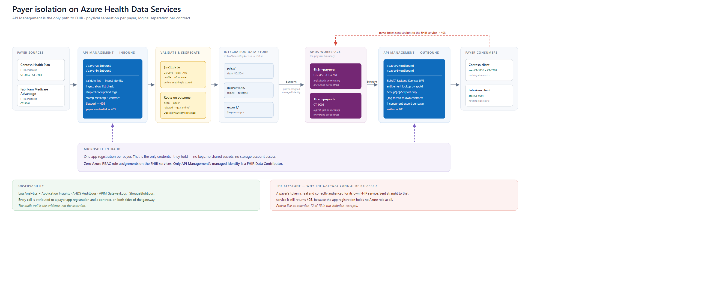

# APIM Payer Isolation on Azure Health Data Services

A runnable reference implementation for **CMS-0057-F (Interoperability and Prior Authorization)**
payer data exchange, using **Azure API Management** as the enforcement point in front of
**Azure Health Data Services FHIR**.

Two payers. Two directions. Six enforcement layers. Sixteen assertions that prove the
contract boundary holds.

> Sanitised from a live proof of concept. All tenant, subscription, application and
> resource identifiers are placeholders. The payer organisations (`Contoso Health Plan`,
> `Fabrikam Medicare Advantage`) and the provider (`Northwind Health`) are fictitious.

---

## The architecture



Read it left to right — data enters on the left and leaves on the right, and the two blue
blocks are the same API Management instance doing two different jobs.

| Band | What to look at |
|---|---|
| **Inbound gateway** | Payers write here. The gateway stamps `meta.tag` with the contract before anything is stored, and strips any tag the caller supplied. `$export` is refused on this side. |
| **Validate & segregate** | `$validate` runs against the profiles first. Clean resources go to `pdex/`, rejects go to `quarantine/` with their `OperationOutcome`. Nothing unvalidated reaches FHIR. |
| **AHDS workspace** | One FHIR service per payer is the *physical* boundary. Inside a service, contracts are separated *logically* by `meta.tag` and one `Group` per contract. |
| **Outbound gateway** | Payers read here. The caller's app id is looked up in the entitlement map, `_tag` is forced to that caller's own contracts, and only `Group/{id}/$export` is allowed. Writes are refused on this side. |
| **Entra band** | The purple lines are the only credential in the picture. Each payer has one app registration and **no Azure role assignment at all**. |
| **Red dashed line** | The bypass attempt — a real, correctly audienced payer token sent straight to the FHIR service. It returns `403`. That is the line that makes the rest of the diagram trustworthy. |

Editable source: [`diagrams/ahds-payer-isolation-architecture.html`](diagrams/ahds-payer-isolation-architecture.html)
(hand-written SVG) and [`diagrams/architecture.mmd`](diagrams/architecture.mmd) (Mermaid).

## The problem this solves

One FHIR service per payer gives you a physical boundary. It does not give you a
**contract** boundary — payer A must not read payer B's members, and within payer A a
caller must not export a contract it is not entitled to. That boundary has to live
somewhere. This puts it in the gateway, and then proves it.

## What is in the box

| Path | What it is |
|---|---|
| `infra/` | Bicep — AHDS workspace, two FHIR services, APIM, storage, Key Vault, Log Analytics, RBAC |
| `apim/policies/` | The two policies that do the work: `payer-inbound.xml`, `payer-outbound.xml` |
| `scripts/` | Onboard a payer, mint a demo token, run the isolation suite, revoke a contract live, show audit attribution |
| `tests/` | `isolation-proofs.http` — the same assertions as REST calls |
| `docs/` | Architecture, decisions, capacity, SMART Backend Services, control plane, cost model |
| `runbooks/` | Payer onboarding, import troubleshooting |
| `DEMO APIM FHIR Sept 1/` | Bruno request collection, captured evidence, portal screenshots, rendered slides |

## The six enforcement layers

Every payer-facing call passes through `apim/policies/payer-outbound.xml` in this order:

| # | Layer | Refuses with |
|---|---|---|
| 1 | Authentication — `validate-jwt`, audience pinned to one FHIR service | `401` |
| 2 | Entitlement — caller app id maps to a payer and a contract set | `403` |
| 3 | Route allow-list — outbound is read-only, inbound cannot export | `403` |
| 4a | Group-scoped bulk export — only entitled group ids | `403` |
| 4b | Contract tag injection — a caller-supplied `_tag` is overridden, never trusted | — |
| 5 | Rate limit, plus one export per payer per 300 s | `429` |
| 6 | Trusted broker — APIM's managed identity calls AHDS; the payer never holds a FHIR role | `403` |

Layer 6 is the keystone: **the payer applications hold zero Azure role assignments.**
A stolen payer token pointed straight at the FHIR service gets a `403` because there is
nothing to steal.

## Prove it

```powershell
./scripts/run-isolation-tests.ps1
```

Sixteen assertions, each naming the layer that refused it — cross-payer read, unentitled
export, write on a read-only route, export on the ingest route, system-level export, a
payer token sent straight to AHDS, caller-supplied tag override, untagged write, and the
export lock firing on a second export inside five minutes.

## Deploy

```powershell
az deployment group create `
  --resource-group <your-rg> `
  --template-file infra/main.bicep `
  --parameters infra/main.bicepparam
```

`infra/main.bicep` takes a `payers` array — adding a payer is a parameter change, not a
new template. Review `infra/main.bicepparam` first: publisher details, operator object id
and the payer list are all environment-specific.

## Cost

Roughly **$160/month** left running 24x7 for the two-payer POC, and **~96% of that is
APIM** — the two FHIR services billed **$0.00** last month. Workspace-based Azure Health
Data Services has no hourly meter at all; it bills on requests, stored GB and export
volume, so instance count is not a billable dimension. Production estimate at ~1.4 TB and
30-40 payers is **about $1,700/month**, of which ~$800 is FHIR consumption. See
[docs/08-cost-model.md](docs/08-cost-model.md) for the actual billed meters.

---

## Not included, on purpose

- No credentials, tokens, connection strings or certificate material of any kind.
- Payer handoff sheets (`out/`) and secret-filled test collections are gitignored.
- Two source decks carrying an information-protection label were removed rather than
  re-published.

## Disclaimer

Sample code provided as-is, without warranty, for reference and demonstration. It is not a
Microsoft product or service, has not been through a formal security review, and is not a
compliance attestation for CMS-0057-F, HIPAA or any other regulation. Validate against
your own security, privacy and regulatory requirements before using any of it with real
PHI.
